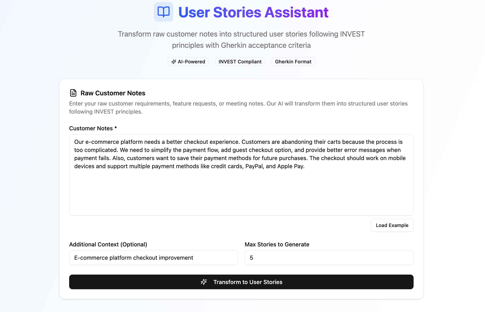
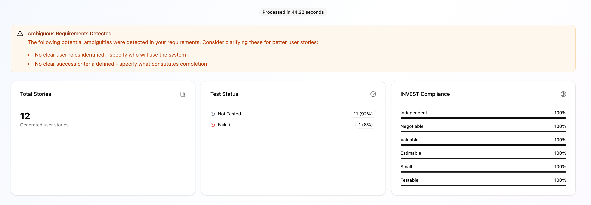
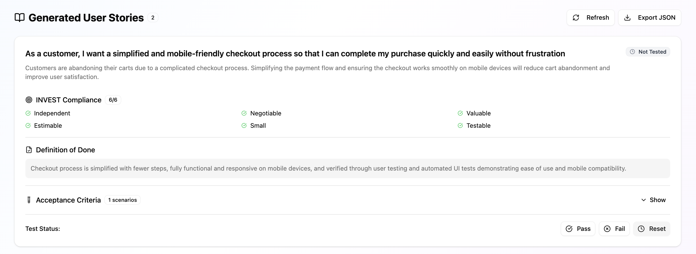
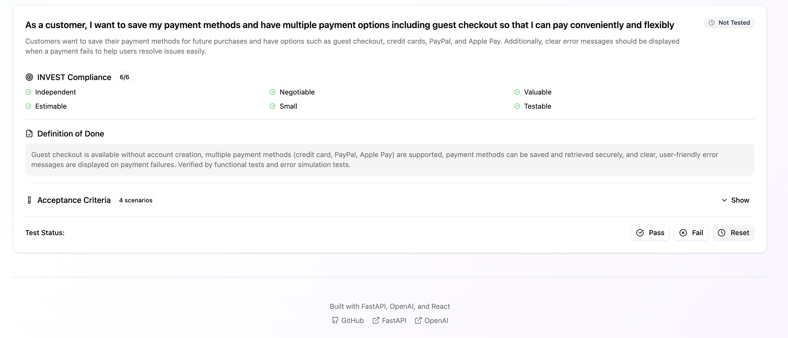

# User Stories Assistant

A comprehensive end-to-end application that transforms raw customer notes into structured user stories following INVEST principles with Gherkin acceptance criteria. Built with FastAPI, OpenAI, and React.

## 🚀 Features

- **AI-Powered Transformation**: Converts raw customer requirements into structured user stories
- **INVEST Compliance**: Ensures user stories follow Independent, Negotiable, Valuable, Estimable, Small, and Testable principles
- **Gherkin Acceptance Criteria**: Automatically generates Given/When/Then scenarios for each user story
- **Ambiguity Detection**: Identifies unclear requirements and suggests improvements
- **Rules Engine**: Validates user stories against business rules and best practices
- **Interactive UI**: Modern React interface for easy interaction and management
- **Test Tracking**: Track acceptance test pass/fail status for each user story
- **Export Functionality**: Export user stories to JSON format
- **Real-time Statistics**: View INVEST compliance and test status metrics

## 🏗️ Architecture

### Backend (FastAPI)
- **FastAPI**: Modern, fast web framework for building APIs
- **Pydantic**: Data validation and settings management with type hints
- **OpenAI Integration**: Structured LLM outputs for user story generation
- **Rules Engine**: Custom validation logic for user story quality

### Frontend (React)
- **React 19**: Modern UI library with hooks and functional components
- **Tailwind CSS**: Utility-first CSS framework for styling
- **shadcn/ui**: High-quality, accessible UI components
- **Lucide Icons**: Beautiful, customizable icons

### Data Models
- **UserStory**: Complete user story with INVEST criteria and acceptance criteria
- **GherkinScenario**: Structured acceptance criteria in Gherkin format
- **InvestCriteria**: Evaluation against INVEST principles
- **ValidationResult**: Rules engine validation output

## 📋 Prerequisites

- Python 3.11 or higher
- Node.js 20 or higher
- OpenAI API key
- Git

## 🛠️ Installation & Setup

### 1. Clone the Repository

```bash
git clone <repository-url>
cd user_stories_assistant
```

### 2. Backend Setup

```bash
# Navigate to backend directory
cd backend

# Install Python dependencies
pip install -r requirements.txt

# Set up environment variables
cp .env.example .env
# Edit .env and add your OpenAI API key
```

### 3. Frontend Setup

```bash
# Navigate to frontend directory
cd ../frontend/user-stories-frontend

# Install Node.js dependencies
npm install
# or
pnpm install
```

### 4. Environment Configuration

Create a `.env` file in the backend directory:

```env
# OpenAI API Configuration
OPENAI_API_KEY=your_openai_api_key_here
OPENAI_API_BASE=https://api.openai.com/v1

# Application Configuration
DEBUG=True
HOST=0.0.0.0
PORT=8000
```

## 🚀 Running the Application

### Start the Backend Server

```bash
cd backend
python main.py
```

The backend API will be available at `http://localhost:8000`

### Start the Frontend Development Server

```bash
cd frontend/user-stories-frontend
npm run dev -- --host
```

The frontend application will be available at `http://localhost:5173`

## 📖 Usage Guide

### 1. Input Raw Notes
- Paste your raw customer requirements, feature requests, or meeting notes into the text area
- Optionally provide additional context about your project
- Set the maximum number of user stories to generate (1-10)

### 2. Transform to User Stories
- Click "Transform to User Stories" to process your notes
- The AI will analyze your requirements and generate structured user stories
- View any detected ambiguities that might need clarification

### 3. Review Generated Stories
Each generated user story includes:
- **Title**: Formatted as "As a [user], I want [goal] so that [reason]"
- **Description**: Detailed explanation of the user story
- **INVEST Criteria**: Evaluation against all six INVEST principles
- **Definition of Done**: Clear completion criteria
- **Acceptance Criteria**: Gherkin scenarios with Given/When/Then steps

### 4. Track Testing Progress
- Mark user stories as Passed, Failed, or Not Tested
- View real-time statistics on test completion
- Monitor INVEST compliance across all stories

### 5. Export Results
- Export all user stories to JSON format
- Import into your project management tools
- Share with development teams

## 🔧 API Documentation

### Core Endpoints

#### `POST /transform_notes`
Transform raw customer notes into user stories.

**Request Body:**
```json
{
  "notes": {
    "content": "Raw customer requirements...",
    "context": "Optional context"
  },
  "max_stories": 5
}
```

**Response:**
```json
{
  "user_stories": [...],
  "ambiguity_flags": [...],
  "processing_time": 2.34
}
```

#### `GET /user_stories`
Retrieve all stored user stories.

#### `PUT /user_stories/{story_id}/acceptance_test`
Update acceptance test status for a user story.

#### `GET /stats`
Get statistics about user stories and testing progress.

### Data Models

#### UserStory
```python
{
  "id": "uuid",
  "title": "As a user, I want...",
  "description": "Detailed description",
  "invest_criteria": {
    "independent": true,
    "negotiable": true,
    "valuable": true,
    "estimable": true,
    "small": true,
    "testable": true
  },
  "definition_of_done": "Clear completion criteria",
  "acceptance_criteria": [
    {
      "scenario_title": "Scenario name",
      "steps": [
        {"keyword": "Given", "text": "precondition"},
        {"keyword": "When", "text": "action"},
        {"keyword": "Then", "text": "expected result"}
      ]
    }
  ],
  "test_status": "not_tested",
  "created_at": "2024-01-01T00:00:00Z"
}
```

## 🧪 Testing

### Backend Tests

```bash
cd backend
python test_simple.py
```

### Frontend Tests

```bash
cd frontend/user-stories-frontend
npm test
```

## 🚀 Deployment

### Backend Deployment

1. **Production Environment Setup**
   ```bash
   pip install -r requirements.txt
   export OPENAI_API_KEY=your_production_key
   export DEBUG=False
   ```

2. **Run with Gunicorn**
   ```bash
   pip install gunicorn
   gunicorn -w 4 -k uvicorn.workers.UvicornWorker main:app --bind 0.0.0.0:8000
   ```

### Frontend Deployment

1. **Build for Production**
   ```bash
   npm run build
   ```

2. **Serve Static Files**
   ```bash
   npm run preview
   # or deploy the dist/ folder to your hosting service
   ```

### Docker Deployment

```dockerfile
# Backend Dockerfile
FROM python:3.11-slim
WORKDIR /app
COPY requirements.txt .
RUN pip install -r requirements.txt
COPY . .
EXPOSE 8000
CMD ["python", "main.py"]
```

```dockerfile
# Frontend Dockerfile
FROM node:20-alpine
WORKDIR /app
COPY package*.json ./
RUN npm install
COPY . .
RUN npm run build
EXPOSE 5173
CMD ["npm", "run", "preview", "--", "--host"]
```

## 🔍 Troubleshooting

### Common Issues

1. **OpenAI API Errors**
   - Verify your API key is correct
   - Check your OpenAI account has sufficient credits
   - Ensure you're using a supported model (gpt-4.1-mini)

2. **CORS Issues**
   - Backend is configured to allow all origins in development
   - For production, update CORS settings in `main.py`

3. **Frontend Build Errors**
   - Clear node_modules and reinstall dependencies
   - Check Node.js version compatibility

4. **Backend Import Errors**
   - Ensure all Python dependencies are installed
   - Check Python version compatibility

### Debug Mode

Enable debug logging in the backend:

```python
import logging
logging.basicConfig(level=logging.DEBUG)
```

## 🤝 Contributing

1. Fork the repository
2. Create a feature branch (`git checkout -b feature/amazing-feature`)
3. Commit your changes (`git commit -m 'Add amazing feature'`)
4. Push to the branch (`git push origin feature/amazing-feature`)
5. Open a Pull Request


## 🙏 Acknowledgments

- [FastAPI](https://fastapi.tiangolo.com/) for the excellent web framework
- [OpenAI](https://openai.com/) for powerful language models
- [React](https://react.dev/) for the frontend framework
- [shadcn/ui](https://ui.shadcn.com/) for beautiful UI components
- [Tailwind CSS](https://tailwindcss.com/) for utility-first styling

## Output




